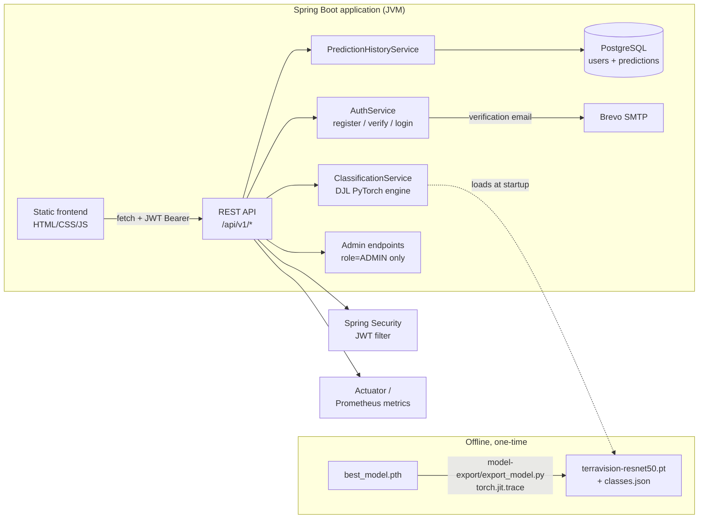

# TerraVision

Satellite land-use classification (EuroSAT / Sentinel-2, 10 classes) served end-to-end on a
Spring Boot + PostgreSQL + Docker stack. A fine-tuned ResNet50 is exported once to TorchScript
and executed **natively inside the JVM** via Deep Java Library (DJL) — no Python process runs
as part of the live application.

For the full reasoning behind every major design choice (especially "why Spring Boot + DJL
instead of a Python backend"), see [ARCHITECTURE.md](ARCHITECTURE.md). For deploying this to
Render or Railway, see [DEPLOYMENT.md](DEPLOYMENT.md).

## Architecture



## Repository layout

```
TerraVision/
├── TerraVision/            # Original Flask prototype (untouched, kept for reference)
├── model-export/           # One-time offline export script (Python)
├── backend/                # Spring Boot application (the live system)
│   ├── src/main/java/ai/terravision/
│   │   ├── inference/       # DJL model loading, preprocessing, /predict
│   │   ├── prediction/      # JPA entity, repository, /history (per-user scoped)
│   │   ├── user/            # User entity, roles, admin account seeding
│   │   ├── auth/            # JWT issuing/parsing, register/verify/login
│   │   ├── admin/           # /admin/users, /admin/predictions (role=ADMIN only)
│   │   ├── mail/            # Verification email (Brevo SMTP)
│   │   ├── stats/           # /stats aggregation (per-user)
│   │   ├── health/          # /health
│   │   ├── security/        # Spring Security config, JWT auth filter
│   │   └── common/          # Error handling, OpenAPI, shared config
│   ├── src/main/resources/
│   │   ├── static/          # Frontend: auth pages, Classify, My History,
│   │   │                    # Model Info, About, Admin Dashboard
│   │   └── db/migration/    # Flyway SQL migrations
│   └── Dockerfile
├── docker-compose.yml       # Postgres + app, for local or containerized runs
├── DEPLOYMENT.md
└── ARCHITECTURE.md
```

## Setup & run (local development)

### 1. One-time model export (Python, offline only)

Requires Python 3.11 or 3.12 specifically — `torch==2.3.1` (pinned to match the libtorch
version DJL 0.29.0 bundles) has no wheel for very new Python releases.

```bash
cd model-export
py -3.12 -m venv venv          # or: python -m venv venv, if your default Python is 3.11/3.12
venv\Scripts\activate          # Windows; source venv/bin/activate on macOS/Linux
pip install -r requirements.txt
python export_model.py
```

This reads `TerraVision/best_model.pth` + `TerraVision/classes.json`, traces the model to
TorchScript, verifies the traced output matches the original (max abs difference must be
< 1e-5), and writes `backend/model/terravision-resnet50.pt` + `backend/model/classes.json`.
**This step only ever needs to be re-run if the model is retrained.**

### 2. Start PostgreSQL

```bash
docker compose up -d postgres
```

### 3. Run the Spring Boot app

Requires a handful of env vars beyond the DB connection (all fail fast with a clear error if
missing, rather than silently falling back to something insecure):

```bash
export TERRAVISION_JWT_SECRET="$(openssl rand -base64 32)"   # 32+ random chars, required
export ADMIN_EMAIL="you@example.com"                          # seeds the one ADMIN account
export ADMIN_PASSWORD="choose-a-real-password"                 # on first run only
export MAIL_FROM_ADDRESS="you@example.com"                     # must be Brevo-verified
export BREVO_SMTP_USERNAME="your-brevo-smtp-login"
export BREVO_SMTP_PASSWORD="your-brevo-smtp-key"

cd backend
mvn spring-boot:run
```

Flyway runs the schema migrations automatically on startup, and `AdminSeeder` creates the one
ADMIN account from `ADMIN_EMAIL`/`ADMIN_PASSWORD` the first time it runs against an empty
`users` table (a no-op on every startup after that). Open `http://localhost:8080` for the UI, or
`http://localhost:8080/swagger-ui.html` for the API docs.

Setting up Brevo (free tier, 300 emails/day): sign up at brevo.com, verify a sender email under
**Senders, Domains & Dedicated IPs**, then get your SMTP login and generate an SMTP key under the
**SMTP & API** tab.

### 4. Run the full containerized stack instead

```bash
docker compose up --build
```

Builds the app image (model files must already exist under `backend/model/` from step 1) and
runs both services with the `prod` Spring profile.

## API reference

All endpoints are versioned under `/api/v1`. Full interactive docs (with request/response
schemas) are at `/swagger-ui.html`; this is the quick reference.

Every endpoint except `/api/v1/health` and `/api/v1/auth/**` requires an `Authorization: Bearer
<jwt>` header, obtained from `/api/v1/auth/login`. `/api/v1/admin/**` additionally requires the
token's role claim to be `ADMIN` (see [ARCHITECTURE.md](ARCHITECTURE.md) for the full auth
design, including why a shared API key was replaced with per-user JWTs).

| Method | Path | Auth | Description |
|---|---|---|---|
| POST | `/api/v1/auth/register` | none | Create an account (unverified until the emailed link is clicked) |
| POST | `/api/v1/auth/resend-verification` | none | Re-send the verification email |
| GET | `/api/v1/auth/verify?token=...` | none | Verifies the account, redirects to `/email-verified.html` |
| POST | `/api/v1/auth/login` | none | Returns a JWT; rejected with 403 if the email isn't verified yet |
| POST | `/api/v1/predict` | JWT | Multipart image upload → top-3 classes with confidence, low-confidence flag |
| GET | `/api/v1/history` | JWT | Paginated history for the logged-in user; filters: `predictedClass`, `from`, `to`, `lowConfidenceOnly` |
| GET | `/api/v1/stats` | JWT | Aggregate stats for the logged-in user |
| GET | `/api/v1/admin/users` | JWT, role=ADMIN | Every registered user, with prediction counts |
| GET | `/api/v1/admin/predictions` | JWT, role=ADMIN | Every prediction across all users; filters: `userId`, `predictedClass`, `from`, `to`, `lowConfidenceOnly` |
| GET | `/api/v1/health` | none | App-level health (model loaded?) |
| GET | `/actuator/health` | none | Infrastructure-level liveness (Spring Boot Actuator) |
| GET | `/actuator/prometheus` | none | Metrics in Prometheus exposition format |

Example:

```bash
TOKEN=$(curl -s -X POST http://localhost:8080/api/v1/auth/login \
  -H "Content-Type: application/json" \
  -d '{"email":"you@example.com","password":"..."}' | jq -r .token)

curl -H "Authorization: Bearer $TOKEN" \
     -F "image=@sample.jpg" \
     http://localhost:8080/api/v1/predict
```

## Model card

- **Task**: single-label classification of a satellite image tile into one of 10 land-use
  classes.
- **Architecture**: ResNet50 (ImageNet-pretrained), final layer replaced with a 10-way linear
  classifier, fine-tuned in two phases (final layer only, then the full network).
- **Dataset**: EuroSAT — 27,000 Sentinel-2 image patches, 64×64 pixels at 10 m/pixel
  resolution, 10 balanced classes.
- **Reported test accuracy**: 97.85% (see `TerraVision/notebooks/LULC_Part1_Image_Classification.ipynb`
  for the full training run and per-class metrics).
- **Serving**: the trained PyTorch model is exported once to TorchScript and executed inside
  the JVM via DJL's PyTorch engine; preprocessing (aspect-preserving letterbox resize to
  224×224, ImageNet normalization) is reimplemented in Java to match training exactly.
- **Known limitation — domain shift**: the model has only ever seen top-down Sentinel-2
  tiles. Ground-level photos, drone imagery, screenshots, or imagery from other sensors will
  typically produce a low, spread-out top-1 probability. Rather than presenting these as
  confident answers, every prediction below a configurable threshold
  (`terravision.inference.confidence-threshold`, default 0.60) is returned with
  `lowConfidence: true` and an explicit warning message, surfaced identically in the JSON API
  and the UI. See [backend's Model Info page](backend/src/main/resources/static/model-info.html)
  for the full limitations writeup.

## Future improvements

Deliberately out of scope for now, not half-implemented:

- **Forgot-password flow.** Registration, email verification, and login all exist; a
  reset-password-via-email flow does not yet. It would reuse the same token-generation and
  Brevo-sending machinery already in `AuthService`/`VerificationMailService` — a new `User`
  field for a reset token + expiry, a `POST /api/v1/auth/forgot-password` to issue and email it,
  and a `POST /api/v1/auth/reset-password` to consume it.
- **Refresh tokens.** JWTs currently expire after 60 minutes with no renewal path; the user has
  to log in again. A refresh-token endpoint would extend a session without re-entering a
  password, at the cost of a second token type to manage securely.
- **Predictor pooling.** `ClassificationService` creates a new DJL `Predictor` per request
  (required since it isn't thread-safe) — fine at this project's scale, but worth pooling if
  concurrent load ever became a bottleneck (see ARCHITECTURE.md's latency section).
